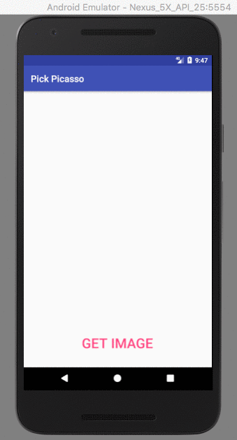

# AndroidWorks

        
Repository that showcases Android Best Practices with Intermediate Project Creation skills

## Contents
**#1 Internet Interact:**
**#2 Picasso Pick:**

## Internet Interact:
An app used to find the followers in Github by supplying his/her accounts user name.(**NOTE:** The app can only show 30 followers at a time since the **GitHub API** JSON Objects are restricted to 30 for an URL).  

**You'll Learn:**
* [Networking in Android](https://developer.android.com/training/basics/network-ops/connecting.html)
* JSON parsing
* Simple List view
* Array List and Adapters 

**Github URL for followers Retival:**  
 
`https://api.github.com/users/ <<User name>> /followers`  
 
**Show case:**

## Picasso Pick:
A simple app that download the image from the given URL and displays it in an image view using **Picasso** library to fetch the image 

**You'll Learn:**
* [Picasso](http://square.github.io/picasso/)
* On click handling  

**URL used for image retival**  
 
`https://image.tmdb.org/t/p/w500//oSLd5GYGsiGgzDPKTwQh7wamO8t.jpg`  
 
Replace the above URL with our own. 
 
**Show case:**

