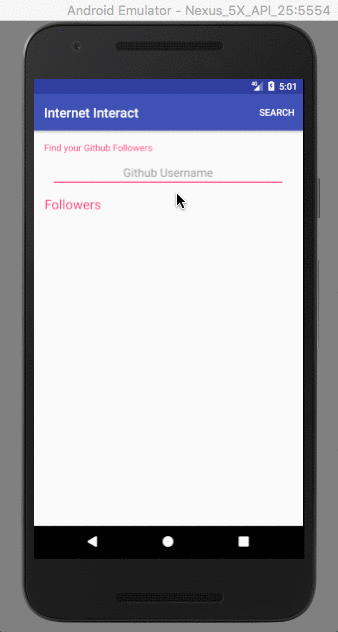

# AndroidWorks

      
Repository that showcases Android Best Practices with Intermediate Project Creation skills

# Contents
**#1 -> Internet Interact:**

## Internet Interact:
An app used to find the followers in Github by supplying his/her accounts user name.(**NOTE:** The app can only show 30 followers at a time since the **GitHub API** JSON Objects are restricted to 30 for an URL).  

**You'll Learn:**
* Networking in Android
* JSON parsing
* Simple List view
* Array List and Adapters 

**Github URL for followers Retival:**  
 
`https://api.github.com/users/ <<User name>> /followers`
 
**Show case:**

